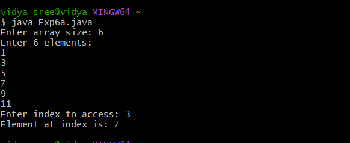

# java-lab-cse-g-5ef-6a
# experiment 6a
## exception handling mechanism
source code 
```
import java.util.Scanner;

public class Exp6a {
    public static void main(String[] args) {
        Scanner sc = new Scanner(System.in);
        System.out.print("Enter array size: ");
        int[] arr = new int[sc.nextInt()];

        System.out.println("Enter " + arr.length + " elements:");
        for (int i = 0; i < arr.length; i++) arr[i] = sc.nextInt();

        System.out.print("Enter index to access: ");
        try {
            System.out.println("Element at index is: " + arr[sc.nextInt()]);
        } catch (ArrayIndexOutOfBoundsException e) {
            System.out.println("Invalid index! Please enter index between 0 and " + (arr.length - 1));
        }
    }
}


```
# OUTPUT: 

